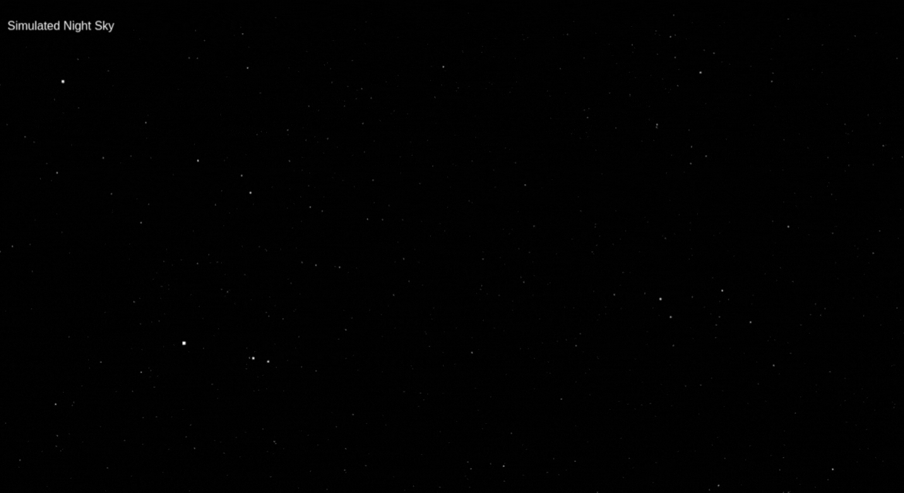

# Observatory Animation 🌌  

An interactive 3D observatory simulation using **Three.js**, featuring celestial animations and a realistic space environment.  

  

## ✨ Features  

- 🚀 Detailed 3D observatory environment  
- 🌠 Smooth & interactive animations  
- 🔭 Camera controls (rotation/zoom)  
- 🌌 Realistic lighting effects  

## 🛠 Technologies  

- [Three.js](https://threejs.org/) - 3D rendering library  
- [WebGL](https://webglfundamentals.org/) - Browser-based 3D graphics  
- [JavaScript ES6](https://developer.mozilla.org/en-US/docs/Web/JavaScript) - Core logic  

## 🚀 Setup  

### Local Development  

1. Clone the repository:  
```bash  
git clone https://github.com/ehsanidev/observatory-animation.git  
```  

2. Navigate to project directory:  
```bash  
cd observatory-animation  
```  

3. Install dependencies:  
```bash  
npm install  
```  

4. Start development server:  
```bash  
npm run dev  
```  

5. Open in browser:  
👉 [http://localhost:3000](http://localhost:3000)  

### Live Demo  
Deployed version: [View Live](https://ehsanidev.github.io/observatory-animation/)  

## 🤝 Contributing  

Contributions are welcome!  

1. Fork the repository  
2. Create a new branch (`git checkout -b feature/your-feature`)  
3. Commit changes (`git commit -m 'Add some feature'`)  
4. Push to branch (`git push origin feature/your-feature`)  
5. Open a Pull Request  

---

Built with ❤️ by [ehsanidev](https://github.com/ehsanidev)  
